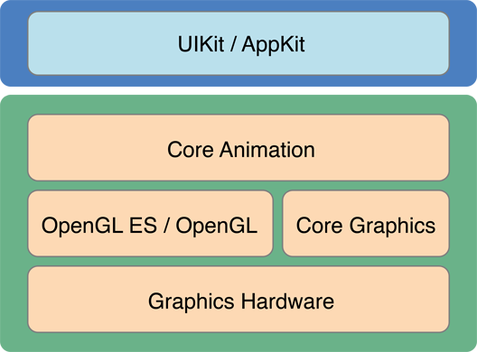

# RootLibraryNote
Notes on iOS basic library like Foundation, CoreAnimation
##一、CoreAnimation
[Official guide](https://developer.apple.com/library/ios/documentation/Cocoa/Conceptual/CoreAnimation_guide/Introduction/Introduction.html)
###Basics
*	Core Animation is a graphics rendering and animation infrastructure available on both iOS and OS X that you use to animate the views and other visual elements of your app.
*	 Core Animation sits beneath AppKit and UIKit and is integrated tightly into the view workflows of Cocoa and Cocoa Touch.



*	UIView和CALayer的区别：Layers are not a replacement for your app’s views—that is, you cannot create a visual interface based solely on layer objects. Layers provide infrastructure for your views. Specifically, layers make it easier and more efficient to draw and animate the contents of views and maintain high frame rates while doing so. However, there are many things that layers do not do. Layers do not handle events, draw content, participate in the responder chain, or do many other things. For this reason, every app must still have one or more views to handle those kinds of interactions.
	
	1.	CALayer继承自NSObject（无法响应事件）, UIView继承自UIResponser，NSObject（可以响应事件）
	2.	Layer提供绘画和动画的基本元素
	3.	UIView是iOS系统中界面元素的基础，所有界面元素都是继承自它。它本身完全是由CoreAnimation来实现。
	4.	一个UIView上可以由n个CALayer，每个CALayer显示一种东西，增强UIView的展现能力。 
	5.	In iOS, every view is backed by a corresponding layer object but in OS X you must decide which views should have layers.


*	Layer主要分为三类：
	1.	数据层（model layer tree）是与app交互最多的，这一层的object存储动画的属性值。
	2.	展示层（presentation tree），数据层包含动画的目标属性值，而展示层包含展示在屏幕上动画的现有属性值，
	3.	渲染层（render tree），在渲染层的Object表现真实的动画，并且是core animation的私有变量
	

	

	
	
*	CALayer的子类
<table class="graybox" border="0" cellspacing="0" cellpadding="5">
  <caption class="tablecaption">
    <strong class="caption_number"></strong>&nbsp;&nbsp;
    CALayer subclasses and their uses</caption>
  <tbody>
    <tr>
      <th scope="col" class="TableHeading_TableRow_TableCell">
        <p>Class</p>
      </th>
      <th scope="col" class="TableHeading_TableRow_TableCell">
        <p>Usage</p>
      </th>
    </tr>
    <tr>
      <td scope="row">
        <p>
          <code>
            CAEmitterLayer</code>
        </p>
      </td>
      <td>
        <p>Used to implement a Core Animation–based particle emitter system. The emitter layer object controls the generation of the particles and their origin.</p>
      </td>
    </tr>
    <tr>
      <td scope="row">
        <p>
          <code>
            CAGradientLayer</code>
        </p>
      </td>
      <td>
        <p>Used to draw a color gradient that fills the shape of the layer (within the bounds of any rounded corners).</p>
      </td>
    </tr>
    <tr>
      <td scope="row">
        <p>
          <code>
            CAMetalLayer</code>
        </p>
      </td>
      <td>
        <p>Used to set up and vend drawable textures for rendering layer content using Metal.</p>
      </td>
    </tr>
    <tr>
      <td scope="row">
        <p>
          <code>
            CAEAGLLayer</code>/
          <code>
            <!--a target="_self" -->CAOpenGLLayer
            <!--/a--></code></p>
      </td>
      <td>
        <p>Used to set up the backing store and context for rendering layer content using OpenGL ES (iOS) or OpenGL (OS&nbsp;X).</p>
      </td>
    </tr>
    <tr>
      <td scope="row">
        <p>
          <code>
            CAReplicatorLayer</code>
        </p>
      </td>
      <td>
        <p>Used when you want to make copies of one or more sublayers automatically. The replicator makes the copies for you and uses the properties you specify to alter the appearance or attributes of the copies.</p>
      </td>
    </tr>
    <tr>
      <td scope="row">
        <p>
          <code>
            CAScrollLayer</code>
        </p>
      </td>
      <td>
        <p>Used to manage a large scrollable area composed of multiple sublayers.</p>
      </td>
    </tr>
    <tr>
      <td scope="row">
        <p>
          <code>
            CAShapeLayer</code>
        </p>
      </td>
      <td>
        <p>Used to draw a cubic Bezier spline. Shape layers are advantageous for drawing path-based shapes because they always result in a crisp path, as opposed to a path you draw into a layer’s backing store, which would not look as good when scaled. However, the crisp results do involve rendering the shape on the main thread and caching the results.</p>
      </td>
    </tr>
    <tr>
      <td scope="row">
        <p>
          <code>
            CATextLayer</code>
        </p>
      </td>
      <td>
        <p>Used to render a plain or attributed string of text.</p>
      </td>
    </tr>
    <tr>
      <td scope="row">
        <p>
          <code>
            CATiledLayer</code>
        </p>
      </td>
      <td>
        <p>Used to manage a large image that can be divided into smaller tiles and rendered individually with support for zooming in and out of the content.</p>
      </td>
    </tr>
    <tr>
      <td scope="row">
        <p>
          <code>
            CATransformLayer</code>
        </p>
      </td>
      <td>
        <p>Used to render a true 3D layer hierarchy, rather than the flattened layer hierarchy implemented by other layer classes.</p>
      </td>
    </tr>
    <tr>
      <td scope="row">
        <p>
          <code>
            <!--a target="_self" -->QCCompositionLayer
            <!--/a--></code></p>
      </td>
      <td>
        <p>Used to render a Quartz Composer composition. (OS&nbsp;X only)</p>
      </td>
    </tr>
  </tbody>
</table>

*	BackgroundColor, Contents, Border的关系


##二、Foundation
[教程](http://swifter.tips/foundation-framework/)
###Basic
Swift 的基本类型都可以无缝转换到 Foundation 框架中的对应类型

这个转换不仅是自动的，而且是双向的，但是转换的结果会更倾向于使用 Swift 类型。
只要你不写明类型是需要 NS 开头的类型的时候，你都会得到一个 Swift 类型。这类转换有下面的对应关系：

*	String - NSString
*	Int, Float, Double, Bool 以及其他与数字有关的类型 - NSNumber
*	Array - NSArray
*	Dictionary - NSDictionary


##三、File System Programming 

[Official Guide](https://developer.apple.com/library/ios/documentation/FileManagement/Conceptual/FileSystemProgrammingGuide/FileSystemOverview/FileSystemOverview.html)


###Basics

*	an app is generally prohibited from accessing or creating files outside its containers. 
*	One exception to this rule occurs when an app uses public system interfaces to access things such as the user’s contacts or music. 


<table class="graybox" border="0" cellspacing="0" cellpadding="5"><caption class="tablecaption"><strong class="caption_number"></strong>&nbsp;&nbsp;Commonly used directories of an iOS app </caption><tbody><tr><th scope="col" class="TableHeading_TableRow_TableCell"><p>Directory</p></th><th scope="col" class="TableHeading_TableRow_TableCell"><p>Description</p></th></tr><tr><td scope="row"><p><em>AppName</em><code>.app</code></p></td><td><p>This is the app’s <span class="pediaLink" data-header="Bundle" data-contents="A bundle is a directory in the file system that groups executable code and related resources such as images and sounds together in one place. "><a data-renderer-version="1" target="_self" onclick="s_objectID=&quot;https://developer.apple.com/library/ios/documentation/General/Conceptual/DevPedia-CocoaCore/Bundl_1&quot;;return this.s_oc?this.s_oc(e):true" data-href="../../../../General/Conceptual/DevPedia-CocoaCore/Bundle.html#//apple_ref/doc/uid/TP40008195-CH4">bundle</a></span>. This directory contains the app and all of its resources. </p><p>You cannot write to this directory. To prevent tampering, the bundle directory is signed at installation time. Writing to this directory changes the signature and prevents your app from launching. You can, however, gain read-only access to any resources stored in the apps bundle. For more information, see the <em><a href="../../../../Cocoa/Conceptual/LoadingResources/Introduction/Introduction.html#//apple_ref/doc/uid/10000051i" data-renderer-version="1" target="_self" onclick="s_objectID=&quot;https://developer.apple.com/library/ios/documentation/Cocoa/Conceptual/LoadingResources/Introduct_1&quot;;return this.s_oc?this.s_oc(e):true">Resource Programming Guide</a></em></p><p>The contents of this directory are not backed up by iTunes. However, iTunes does perform an initial sync of any apps purchased from the App Store.</p></td></tr><tr><td scope="row"><p><code>Documents/</code></p></td><td><p>Use this directory to store user-generated content. The contents of this directory can be made available to the user through file sharing; therefore, his directory should only contain files that you may wish to expose to the user. </p><p>The contents of this directory are backed up by iTunes.</p></td></tr><tr><td scope="row"><p><code>Documents/Inbox</code></p></td><td><p>Use this directory to access files that your app was asked to open by outside entities. Specifically, the Mail program places email attachments associated with your app in this directory. Document interaction controllers may also place files in it. </p><p>Your app can read and delete files in this directory but cannot create new files or write to existing files. If the user tries to edit a file in this directory, your app must silently move it out of the directory before making any changes.</p><p>The contents of this directory are backed up by iTunes.</p></td></tr><tr><td scope="row"><p><code>Library/</code></p></td><td><p>This is the top-level directory for any files that are not user data files. You typically put files in one of several standard subdirectories. iOS apps commonly use the <code>Application Support</code> and <code>Caches</code> subdirectories; however, you can create custom subdirectories.</p><p> Use the <code>Library</code> subdirectories for any files you don’t want exposed to the user. Your app should not use these directories for user data files. </p><p>The contents of the <code>Library</code> directory (with the exception of the <code>Caches</code> subdirectory) are backed up by iTunes.</p><p>For additional information about the Library directory and its commonly used subdirectories, see <span class="content_text"><a href="#//apple_ref/doc/uid/TP40010672-CH2-SW1" data-renderer-version="1" onclick="s_objectID=&quot;https://developer.apple.com/library/ios/documentation/FileManagement/Conceptual/FileSystemProgram_4&quot;;return this.s_oc?this.s_oc(e):true">The Library Directory Stores App-Specific Files</a></span>.  </p></td></tr><tr><td scope="row"><p><code>tmp/</code></p></td><td><p>Use this directory to write temporary files that do not need to persist between launches of your app. Your app should remove files from this directory when they are no longer needed; however, the system may  purge this directory when your app is not running. </p><p>The contents of this directory are not backed up by iTunes.</p></td></tr></tbody></table>


###Where you should put your app's file
*	Put user data in Documents/. User data generally includes any files you might want to expose to the user—anything you might want the user to create, import, delete or edit. For a drawing app, user data includes any graphic files the user might create. For a text editor, it includes the text files. Video and audio apps may even include files that the user has downloaded to watch or listen to later.

*	Put app-created support files in the Library/Application support/ directory. In general, this directory includes files that the app uses to run but that should remain hidden from the user. This directory can also include data files, configuration files, templates and modified versions of resources loaded from the app bundle.

*	Remember that files in Documents/ and Application Support/ are backed up by default. You can exclude files from the backup by calling -[NSURL setResourceValue:forKey:error:] using the NSURLIsExcludedFromBackupKey key. Any file that can be re-created or downloaded must be excluded from the backup. This is particularly important for large media files. If your application downloads video or audio files, make sure they are not included in the backup.

*	Put temporary data in the tmp/ directory. Temporary data comprises any data that you do not need to persist for an extended period of time. Remember to delete those files when you are done with them so that they do not continue to consume space on the user’s device. The system will periodically purge these files when your app is not running; therefore, you cannot rely on these files persisting after your app terminates.

*	Put data cache files in the Library/Caches/ directory. Cache data can be used for any data that needs to persist longer than temporary data, but not as long as a support file. Generally speaking, the application does not require cache data to operate properly, but it can use cache data to improve performance. Examples of cache data include (but are not limited to) database cache files and transient, downloadable content. Note that the system may delete the Caches/ directory to free up disk space, so your app must be able to re-create or download these files as needed.


##四、Caches In NSUrlSession

###Basics
An NSURLRequest instance specifies how the local cache is used by setting the cache policy to one of the NSURLRequestCachePolicy

The default cache policy for an NSURLRequest instance is 

*	NSURLRequestUseProtocolCachePolicy. The NSURLRequestUseProtocolCachePolicy behavior is protocol specific and is defined as being the best conforming policy for the protocol.

*	Setting the cache policy to NSURLRequestReloadIgnoringCacheData causes the URL loading system to load the data from the originating source, ignoring the cache completely.

*	The NSURLRequestReturnCacheDataElseLoad cache policy causes the URL loading system to use cached data, ignoring its age or expiration date, and to load the data from the originating source only if there is no cached version.

*	The NSURLRequestReturnCacheDataDontLoad policy allows an application to specify that only data in the cache should be returned. Attempting to create an NSURLConnection or NSURLDownload instance with this cache policy returns nil immediately if the response is not in the local cache. This is similar in function to an “offline” mode and never brings up a network connection.

###Implementation

```Objective-C
-(NSCachedURLResponse *)connection:(NSURLConnection *)connection
                 willCacheResponse:(NSCachedURLResponse *)cachedResponse
{
    NSCachedURLResponse *newCachedResponse = cachedResponse;
 
    NSDictionary *newUserInfo;
    newUserInfo = [NSDictionary dictionaryWithObject:[NSDate date]
                                                 forKey:@"Cached Date"];
    if ([[[[cachedResponse response] URL] scheme] isEqual:@"https"]) {
#if ALLOW_IN_MEMORY_CACHING
        newCachedResponse = [[NSCachedURLResponse alloc]
                                initWithResponse:[cachedResponse response]
                                    data:[cachedResponse data]
                                    userInfo:newUserInfo
                                    storagePolicy:NSURLCacheStorageAllowedInMemoryOnly];
#else // !ALLOW_IN_MEMORY_CACHING
        newCachedResponse = nil
#endif // ALLOW_IN_MEMORY_CACHING
    } else {
        newCachedResponse = [[NSCachedURLResponse alloc]
                                initWithResponse:[cachedResponse response]
                                    data:[cachedResponse data]
                                    userInfo:newUserInfo
                                    storagePolicy:[cachedResponse storagePolicy]];
    }
    return newCachedResponse;
}
```


```Objective-C

if (有网) { 
cachePolicy = NSURLRequestUseProtocolCachePolicy; 
} 
else{ 
cachePolicy = NSURLRequestReturnCacheDataDontLoad; 
}
```

###NSURLCache (2 lines for 80% work)

```Objective-C

- (BOOL)application:(UIApplication *)application didFinishLaunchingWithOptions:(NSDictionary *)launchOptions
{
    // Set app-wide shared cache (first number is megabyte value)
    NSUInteger cacheSizeMemory = 500*1024*1024; // 500 MB
    NSUInteger cacheSizeDisk = 500*1024*1024; // 500 MB
    NSURLCache *sharedCache = [[NSURLCache alloc] initWithMemoryCapacity:cacheSizeMemory diskCapacity:cacheSizeDisk diskPath:@"nsurlcache"];
    [NSURLCache setSharedURLCache:sharedCache];
    sleep(1); // Critically important line, sadly, but it's worth it!
}

```